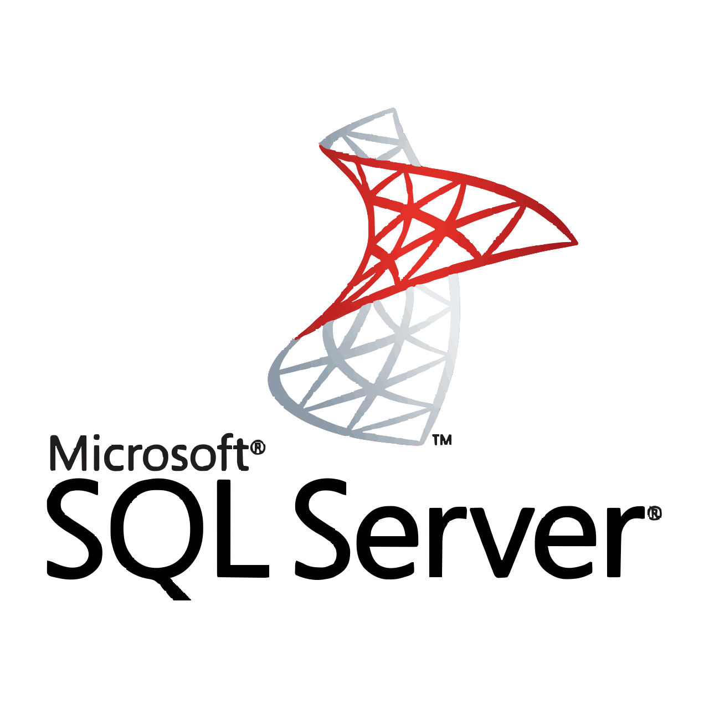
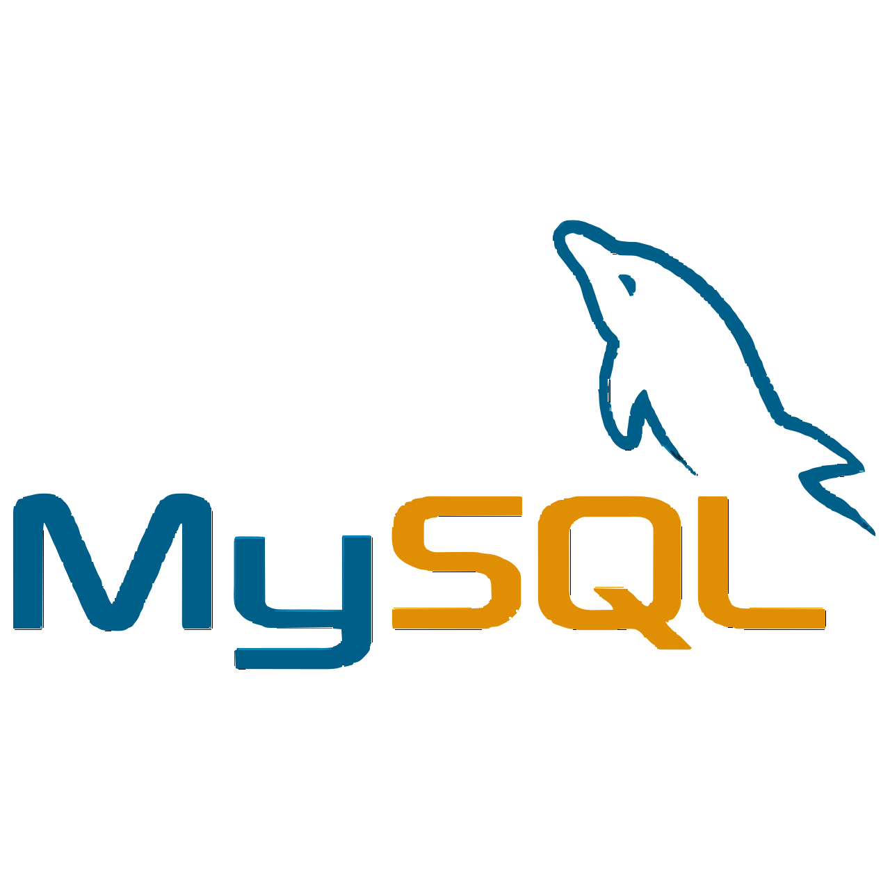

## Hi there 👋
### I'm Herlon Ludwig.
### A passionate technology student from Brazil.

Know about my experiences [LinkedIn](https://www.linkedin.com/in/herlonromualdoludwig1967/)
 

    

        
    

    

        
    

     

 
 
 
 
 
 
 
 
 
 
 

## Languages and Tools:

    
     
     
     
     
    
     
     
     
     
     
     
    
      

