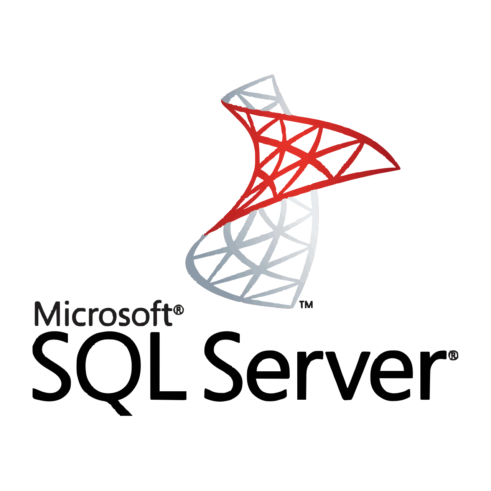
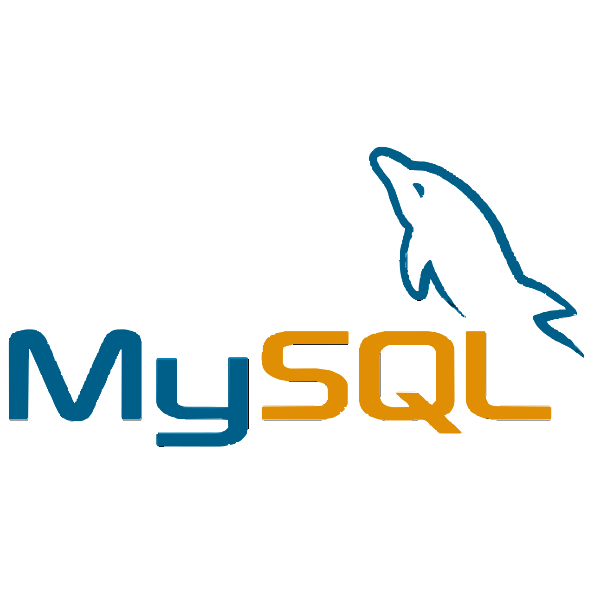

## Hi there 👋
### I'm Herlon Ludwig.
### A passionate technology student from Brazil.

Know about my experiences [LinkedIn](https://www.linkedin.com/in/ludwighr)

 

  

 

## Languages and Tools:

     
     
     
     
     
     
     
     
     
    
      

